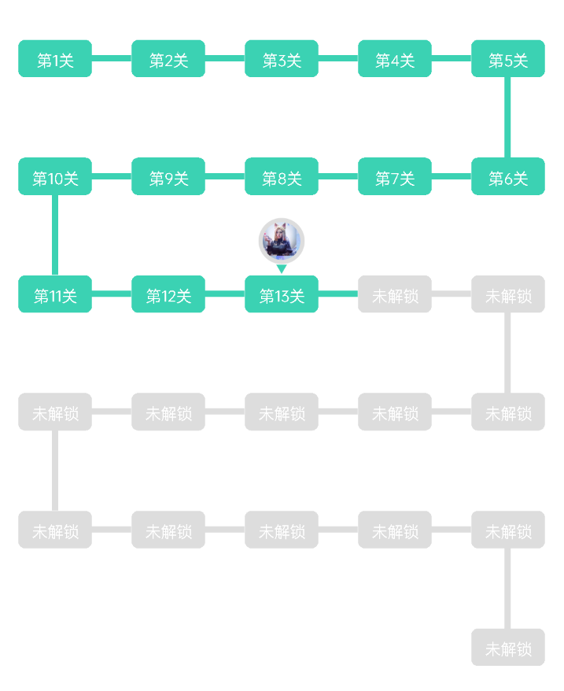

# GameStageView
游戏闯关View、闯关文字、解锁 + 未解锁、2字形路径
# 预览

# 资源
|名字|资源|
|-|-|
|AAR|[game_stage_view.aar](https://github.com/RelinRan/GameStageView/blob/master/game_stage_view_2022.7.29.1.aar)|
|GitHub |[GameStageView](https://github.com/RelinRan/GameStageView)|
|Gitee|[GameStageView](https://gitee.com/relin/GameStageView)|
# Maven
1.build.grade | setting.grade
```
repositories {
	...
	maven { url 'https://jitpack.io' }
}
```
2./app/build.grade
```
dependencies {
	implementation 'com.github.RelinRan:GameStageView:2022.7.29.1'
}
```
# xml  
注意:Item个数过多情况请嵌套NestedScrollView或者ScrollView
~~~
<androidx.widget.GameStageView
    android:id="@+id/game_stage"
    android:layout_width="match_parent"
    app:itemHeadSrc="@mipmap/ic_head"
    android:layout_height="wrap_content" />
~~~
# attrs.xml
~~~
<!--item宽度-->
<attr name="itemWidth" format="dimension" />
<!--item高度-->
<attr name="itemHeight" format="dimension" />
<!--item圆角大小-->
<attr name="itemRadius" format="dimension" />
<!--item文字大小-->
<attr name="itemTextSize" format="dimension" />
<!--分割线颜色-->
<attr name="itemDividerColor" format="color" />
<!--水平分割线宽度-->
<attr name="itemDividerHorizontalWidth" format="dimension" />
<!--水平分割线高度-->
<attr name="itemDividerHorizontalHeight" format="dimension" />
<!--垂直分割线宽度-->
<attr name="itemDividerVerticalWidth" format="dimension" />
<!--垂直分割线高度-->
<attr name="itemDividerVerticalHeight" format="dimension" />
<!--item总数-->
<attr name="itemCount" format="integer" />
<!--列数-->
<attr name="columnCount" format="integer" />
<!--当前关1开始-->
<attr name="itemPosition" format="integer" />
<!--解锁文字颜色-->
<attr name="itemUnlockTextColor" format="color" />
<!--未解锁文字颜色-->
<attr name="itemLockTextColor" format="color" />
<!--解锁背景颜色-->
<attr name="itemUnlockBackgroundColor" format="color" />
<!--未解锁背景颜色-->
<attr name="itemLockBackgroundColor" format="color" />
<!--内部左间距-->
<attr name="InnerPaddingLeft" format="dimension" />
<!--内部右边距-->
<attr name="InnerPaddingRight" format="dimension" />
<!--内部上间距-->
<attr name="InnerPaddingTop" format="dimension" />
<!--头像资源-->
<attr name="itemHeadSrc" format="reference" />
<!--头像大小-->
<attr name="itemHeadSize" format="dimension" />
<!--头像边线颜色-->
<attr name="itemHeadStrokeColor" format="color" />
<!--头像边线宽度-->
<attr name="itemHeadStrokeWidth" format="dimension" />
<!--头像箭头颜色-->
<attr name="itemHeadArrowColor" format="color" />
<!--头像箭头上间距-->
<attr name="headArrowMarginTop" format="dimension" />
~~~
# 使用
~~~
GameStageView game_stage = findViewById(R.id.game_stage);
//头像资源
game_stage.setItemHeadSrc(R.mipmap.ic_head);
//关数
game_stage.setItemCount(26);
//已闯关数
game_stage.setItemPosition(13);
//Item点击事件
game_stage.setOnGameItemClickListener((position, lock) -> {
    Log.e("Game", "position=" + position + ",lock=" + lock);
});
//头像点击事件
game_stage.setOnGameHeadClickListener((position, lock) -> {
    Log.e("Game", "position=" + position + ",lock=" + lock);
});
~~~
